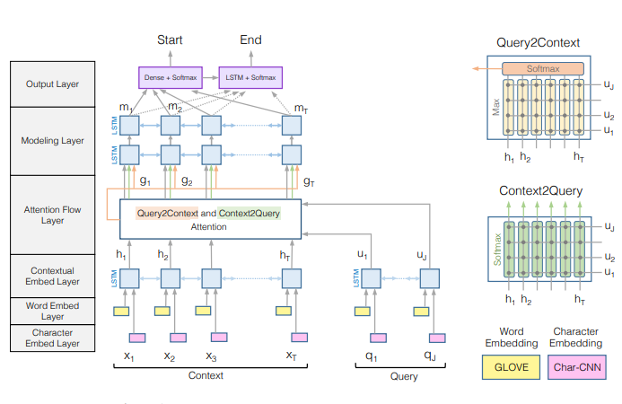

## Introduce Bi-Directional Attention Flow 

### Model 

1. **Character Embedding Layer** : map each word to a vector space using character-level CNN 

* Input: $ \{x_1,x_2, ..., x_T\}$ and $\{q_1, q_2, ..q_J\}$ represent the words in context and query. Using character-level embedding for each word using CNN. 

2. **Word Embedding Layer**: map each word to a vector space using word-embedding(GLOVE) 

==> Concatenation the character and word embedding vector is pass to a two-layer Highway Network. The output of Highway Network are two matrix $ X \in \mathbb{R} ^{d.T}$ for the context and $Q \in \mathbb{R}^{d.J}$ for the query

3. **Contextual Embedding Layer**: We use LSTM on top of embedding provide by the previous layer to model the temporal interactor between word. We place LSTM in both directions and concatenate the output of the two LSTMs -> $H \in \mathbb{R}^{2d.T}$ from the context word vector X and $U \in \mathbb{R}^{
2d.J}$ from the query word vector. Each column of **H** and **U** is concatenation of the output of the forward and backward LSTMs - 2._d_ dimensional

The first three layer of the model are computing feature from the query and context at different level. 

4.**Attention Flow Layer**: reponsibale for linking and fusing infomation from context and query. Unlike previous popular attention mechanism ... the attention flow layer is not used to summarize the query and context into single feature vector. Instead, the attention vector at each time step,along with the embebdding from previous layers, are allowed to flow through to the subsequent modeling layer. Reduce infomation loss caused by early summarization

* Input: context $H$ and query $U$ 
* Output: query-aware vector representation of the context word $G$ along with the contextual embedding from previous layer

In this layer, we compute attention in two directions: from context to query and from query to context. 

The similar matrix: 
$$ S_{t.j} = \alpha (H_{:t},U_{:j}) \in \mathbb{R}$$

where $\alpha$  is trainable scalar function. $H_{:t}$ is t-th column vector of $H$ . $U_{:j}$ is j-th column of $U$  

We choose:
$$\alpha(\bold{h},\bold{u}) = W^T_{(s)}[\bold{h},\bold{u};\bold{h}*\bold{u}]$$ 

where $W_{(s)} \in \mathbb{R}^{6d}$ is a trainable weight vector, $*$  is elementwise multiplication, $[;] is vector concatenation across row$

* Context-to-Query(C2Q): which query word are most relevant to each context word. Let $a_t \in R^J$ represent the attention weight on the query word by t-th context word. $\sum a_{t.j} = 1$ for all t. The attention weight is computed by $a_t = softmax(S_t) \in R^j$ 

* Query-to-Context (Q2C): which context word are most relevant to each query word 
We obtain the attention weight on the context word by $b = softmax(max_{col}(S)) \in \mathbb{R}^T$. where the max function ($max_{col}$) is performed across the column. Then the attended context vector is $h = \sum_t b_t.H_t \in \mathbb{R}^{2d}$

Finally:
$$G_{:t} = \beta(H_{:t},\hat{U}_{:t},\hat{H}_{:t}) $$

5.**Modeling Layer**
* Input: $G$ - encodes the query-aware representation of context word. 
* Output: The interaction among the context words conditioned on the query 

We use two layers of bi-directional LSTM with output size of d for each direction. We obtain a matrix $M \in \mathbb{R}^{2d.T}$

6.**Output Layer**: 
We compute probability distribution of start index over the entire paragraph: 
$$p^1 = softmax(w^T_{p^1}[G;M])$$
$$p^2 = softmax(w^T_{p^2}[G;M^2])$$
**Training**: 
* Loss function: 
$$L(\theta) = -\frac{1}{N} \sum_i^N log(p^1_{y_i^1}) + log(p^2_{y^2_i})$$

----------
**References** 

[1] Minjoon Seo, Aniruddha Kembhavi, Ali Farhadi, and Hananned Hajishiri. Bi-Directional Attention Flow for Machine Comprehension, ICLR 2017 