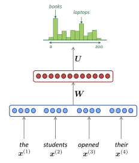
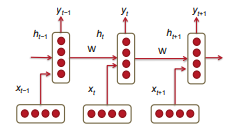
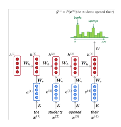

## Lecture 5 
--------------------------------
### 1. Language Models 
#### 1.1 Introduction 

* Language models tính toán xác suất xuất hiện của một số các từ theo một trình tự cụ thể. Xác suất của chuỗi $m$ từ ${w_1, ...,w_m}$ kí hiệu là P(w_1,w_2,..,w_m). và nếu coi như xác suất của một từ chỉ phụ thuộc vào $n$ từ trước đó thì ta có: 

$$ p(w_1,..,w_m) = \prod_{i=1}^{i=m}P(w_i|w1,...,w_{i-1}) ~ \prod_{i=1}^{i=m}P(w_i|w_{i-n},...,w_{i-1})$$

* Trong các hệ thống dịch hiện nay thì từ một cụm từ/ câu thì phần mềm sẽ tạo ra một số chuỗi từ (VD: _I have_ , _I had_ , ...) và chấm điểm chúng để xác định trình từ chính xác. 

* Trong machine translation. moodel chọn thứ tự từ tốt nhất bằng cách gán _goodness_ score cho mỗi đầu ra.. Để làm như vậy, model có thể chọn giữa các thứ tự từ khác nhau hoặc các lựa chọn thay thế từ khác nhau. Nó làm điều này bằng cách chạy qua tất cả cá ứng viên và chọn ra cái có _goodness_ lớn nhất. 

#### 1.2 n-gram Language Model 

* Để tính xác suất được để cập ở trên, số lượng mỗi n-gram có thể được so sánh với tần số của mỗi từ được gọi là n-gram Language Model. 

* Unigram - 1 từ trước đó 

$$p(w_2|w_1) = \frac{count(w_1,w_2)}{count(w_1)}$$
* Bigram - 2 từ trước đó 

$$p(w_3|w_1,w_2)  = \frac{count(w_1,w_2,w_3)}{count(w_1,w_2)}$$

* $v.v $

* Sự khác nhau giữa n-gram và mô hình phân loại naive bayes là n-grams là phụ thuộc vào chuỗi xác suất n từ còn navie là xác suất của từ này với từ kia riêng lẻ

* Tuy nhiên bao nhiêu từ trước đó là đủ ?? và nếu trường hợp cửa sổ gồm $1,2,..,n$ từ không đủ để nắm bắt được context của câu thì sao ???

* Hai vấn đề chính với phương pháp này: 

    * <b>Sparsity</b> : Sự thưa thớt. Giả sử dự đoán từ $c$ sau $a$ và $b$. Nếu sau $ab$ ko có c trong từ điển thì $p = 0$. Còn nếu $a$ và $b$ ko bao giờ xuất hiện cùng nhau trong từ điển thì mẫu số của phương trình = 0. Vậy làm sao để tính $p$ ? Cách giải quyết là thêm tham số $\gamma$ nhỏ để _smoothing_ và có thể thêm điều kiện vào $w_2$ -> _backoff_. Và lưu ý $n$ càng lớn thì độ thưa thớt càng tăng 

    * <b>Storage</b> : Chúng ta bảo lưu tất cả các bản đếm của n-grams trong từ điển. Nếu n càng tăng thì size của model cũng tăng 

#### 1.3 Window-based Neural Language Model 

* "Curse of dimensionality" được giải quyết lần đầu tiên trong model _distributed representation of words_  cũng với hàm xác suất cho các chuỗi từ được biểu thị theo các đại diện. 

* Một phiên bản đơn giản của mô hình này: 
    
    * Input: Word embedding $\textbf{e} = [e_1,e_2,..e_3]$
    * Hidden_layer: $\textbf{h} = f(W\textbf{e} + b_1) $
    * Output: $\hat{y} = softmax(U\textbf{h} + b_2) $ 

    * 

### 2. Recurrent Neural Networks (RNN)

* Điểm yếu của các mô hình trên là có n cố định và có không thể biết n lớn bn là đủ trong khi n càng lớn thì càng <b>Sparsity</b> và càng tốn <b> Storage</b> 

* Vì vậy người ta nghĩ ra mô hình RNN. Có khả năng điều chỉnh mô hình trên tất cả các từ trước đó trong từ điển.

* Mô hình RNN cơ bản : 

    * <b>Input</b>: $x = \{x_1,x_2,..,x_N\}$ và hidden state $h_0$

    * <b>Forward</b>: 

    $$h_t = \sigma(W^{(hh)}h_{t-1} + W^{(hx)}x_{[t]} + bx)$$  

    * <b>Output</b>: 
    $$\hat{y} = softmax(W^{(s)}h_t + by)$$
     
    *  

* Điều thú vị ở model này là $W^{(hh)}$ và $W^{(hx)}$ - tham số của mô hình là giống nhau cho tất cả các timestep. Như vậy số tham số phải học ít hơn và quan trọng nhất là độc lập với độ dài chuỗi đầu vào -> đánh bại "curse of dimentionality"

* Dưới đây là kích thước chi tiết từng tham số:
    
    * $x_i \in \mathbb{R}^d$  
    * $W^{(hx)} \in \mathbb{R}^{D_h * d}$
    * $W^{(hh)} \in \mathbb{R}^{D_h*D_h}$
    * $h_{t-1} \in \mathbb{R}^{D_h}$

    * $h_t \approx  (\mathbb{R}^{D_h*D_h} * \mathbb{R}^{D_h*1} + \mathbb{R}^{D_h * d} * \mathbb{R}^{d * 1})  \approx h_{t-1}$ 

    * $W^{(s)} \in \mathbb{R}^{D_{out} * D_h} $

    * Trong đó $d$ là chiều của embedding của input còn $D_h$ là hidden dim và $D_{out}$ là output dim.

    
*   

#### 2.1 RNN Loss 

* Loss function được sử dụng trong RNN thường là Cross-Entropy Error. 

$$J(\theta) = \sum_{j=1}^{|V|}y_j*log(\hat{y}_j)$$

2.2 Advantage, Disadvantages and Applications of RNNs
* Advantages: 

    * Độ dài đầu vào không giới hạn 
    * Kích thước mô hình không tăng lên nếu độ dài đầu vào tăng 
    * Các W - trọng số được áp dụng cho mọi timestep nên có sự đối xứng trong các xứ lý đầu vào. 

* Disadvantages: 

    * Tính toán chậm vì phải tuần tự 

    * Lý thuyết thì có sử dụng các từ đầu tiên trong câu nhưng thực tế khó tiếp cận thông tin từ các từ ở đầu câu do vấn đề vanishing/ exploding trong quá trình train. 

* Dung lượng bộ nhớ cần thiết để chạy 1 lớp RNN tỷ lệ với số lượng từ trong câu. Ví dụ 1 câu có k từ thì k vector từ sẽ được lưu trong bộ nhớ. Còn với các trọng số thì nó không mở rộng theo kích thước kho văn bản nhưng nó cũng có thể rất lớn ví dụ như đối với 1000 layers thì ma trận sẽ là 1000*1000 bất kể câu ngắn hay dài

* RNN có nhiều ứng dụng với một số bài toán phổ biến như: Sentiment speech, NER, Sentence classification, question answering, machine transaltion, ... 

#### 2.3 Vanishing Gradient & Gradient explosion Problem 

- Phần nãy sẽ học kỹ hơn trong các kỹ thuật DL cơ bản - 

#### 2.4 Solution to the Exploding & Vanishing Gradient 

- Các kĩ thuật cơ bản đã nói rồi - 
    
    *  Gradient Clip 
    * Weight init 
    * Using RELU 
- Có một cách khác là sử dụng các dạng nâng cao hơn của RNN là GRU/LSTM 

#### 2.5 Deep Bidirectional RNNs 

#### 2.6 Application RNN Translation Model 

### 3. Gated Recurrent Unit (GRU) 

### 4. Long-Short-Term-Memories(LSTM) 

