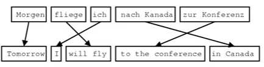
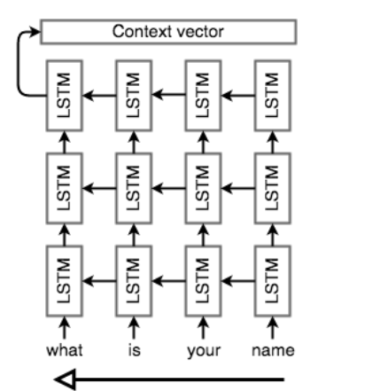

## Lecture 6

### 1. Neural Machine Translation with Seq2Seq

* Cho đến nay chúng ta đã giải quyết các vấn đề về dự đoán 1 đầu ra(VD: Language Model, Text classification, ...). Nhưng trong thực tế còn một lớp nhiệm vụ NLP có đầu ra trình tự có độ dài không cố định. Ví dụ: 

    * Translation
    * Conversation
    * Summarization 

#### 1.1 Brief Note on Historical Approaches 

* Trước đây hệ thống dịch thuật dựa trên probabilistic model 

* Input($x$ - English) -> output($y$-French) ta có: 

$$y= argmax_yP(x|y)P(y)$$

trong đó:  
1. $P(x|y)$: Translation Model - cho chúng ta biết câu/ cụm từ trong ngôn ngữ nguồn có thể dịch sang là gì ? 
2. $P(y)$: Language Model - cho chúng ta biết khả năng xảy ta của một câu/cụm từ 

* How to learn translation model $P(x|y)$ ?? 

1. Cần có parallel data - cặp data nguồn - dịch 

2. Biến ngầm $a$ còn gọi là aligment - thể hiện sự liên kết giữa các từ trong nguồn và trong bản dịch
    
    * VD:   
    

    * Có nhiều dạng aligment tùy thuộc vào dữ liệu: one-many,many-one,many-many, có từ có thể ko được dịch từ từ nào

Các thành phần này được sử dụng để xây dựng hệ thống dịch thuật dựa trên từ/cụm từ. Như chúng ta có thể đoán được nếu hệ thống dựa hoàn toàn vào từ sẽ ko thể nắm bắt được thứ tự giữa các từ trong ngôn ngữ

=> Vì thế hệ thống dịch dựa trên cụm từ có thể xử lý các cú pháp phức tạp hơn chỉ dựa trên từ. Tuy nhiên sự phụ thuộc "lâu dài"(tức là các từ ở cuối câu có thể phụ thuộc vào các từ đầu câu) vẫn còn khó nắm bắt trong các hệ thống trên cụm từ. Lợi thế mà Seq2Seq và LSTM đem lại là hệ thống có thể tạo ra đầu ra tùy í sau khi xem toàn bộ đầu vào. Họ còn có thể tự động tập trung vào phần cụ thể của đầu vào để tạo ra một bản dịch.

1.2 Sequence-to-Sequence Basics 

* Gồm 2 mạng RNN: 
    
    * Encoder: lấy chuỗi đầu vào của model và encode nó thành "context vector"
    * Decoder: Nó sử dụng "context vector" ở trên để từ đó tạo ra chuỗi đầu ra 

1.3 Seq2Seq architecture - encoder 

* Đọc chuỗi đầu vào và tạo ra context vector có chiều cố định C. 

* Thường sử dụng LSTM để đọc từng token đầu vào. Tuy nhiên bởi rất khó nén một chuỗi bất kì thành một chuỗi có độ dài tùy ý nên một vector có kích thước cố định. Vì thế bộ encoder thường bao gồm các LSTM xếp chồng lên nhau. Các lớp LSTM trong đó đầu ra mỗi lớp là chuỗi đầu vào của lớp tiếp theo. Trạng thái ẩn LSTM của lớp cuối cùng sẽ được sử dụng làm C.

* 

* Như hình trên có thể thấy encoder xử lý chuỗi ngược lại so với chuỗi đầu vào. Điều này thực hiện là có lý do: 
    
    *  Để điều cuối cùng mà encoder thực hiện tương ứng với điều đầu tiên mà model xuất ra, điều này giúp decoder bắt đầu output dễ dàng và thích hợp hơn. 

    * Và nhờ tiếp xúc với những từ đầu tiên nên chúng ta sẽ cho phép dịch các từ đó ngay khi nhìn thấy chúng chứ không đợi cả câu để dịch, từ đó sẽ dịch chính xác hơn. 

    * Tuy nhiên đôi khi không cần thiết ví dụ nếu encoder và decoder đều là RNN hai chiều 

    1.4 