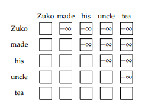
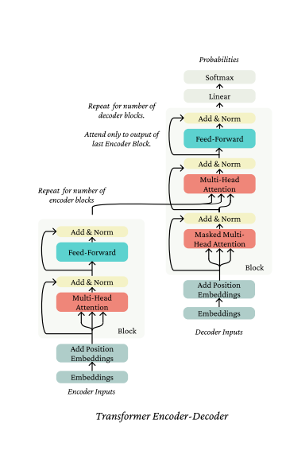

## Slide
#### 1. From RNN to attention-based NLP models 
#### 2. The Transformer model 
#### 3. Great result with Transformers 
#### 4. Drawbacks and variant of Transformer 

 ---------------------------------------------------------
## Lecture Note 
### 1. Neural architectures and their properties 

#### 1.1 Notation and basics

* Kí hiệu :  $\boldsymbol{w_{1:n}}$ là sequence trong đó $\boldsymbol{w_i} \in \mathbb{R^{[V]}}$

* Ta có : 
    $$\boldsymbol{w_t} \approx softmax (f(\boldsymbol{w_{1:t-1}}))$$

* Ngoài ra để rút gọn đầu vào chúng tôi sử dụng 1 embedding matrix $E \in R^{d*[V]}$ với hidden dimensional $d$

#### 1.2 Default crica 2017: RNN 

Một dạng RNN đơn giản như sau: 
$$\boldsymbol{h_t} = \sigma(W.\boldsymbol{h_{t-1}} + U.\boldsymbol{x_t} )$$

Trong ta có hai vấn đề với RNN cần giải quyết ở đây: 

1. Parallelization issues dependence on the sequence index ( Song song hóa sự phụ thuộc vào chỉ số trình tự). 
    
    * Hiện nay GPU có khả năng xử lý rất tốt nhiều tác vụ đơn giản song song với nhau. Nhưng trong RNN thì lại phải xử lí tuần tự, nếu không tính được $h_1$ sẽ không thể tính $h_2$. Vì vậy để tận dụng tối đa sức mạnh của GPU thì chúng ta cần loại bỏ sự phụ thuộc tuần tự này. 

2. Linear interaction distance (Khoảng cách tương tác tuyến tính) 
    
    * Một vấn đề liên quan với RNN là khó khăn trong việc các token ở xa nhau trong câu khó có thể tương tác với nhau. 
    * Khai niệm về sự tương tác này có thể nhắc nhở bạn về attention mechanism trong machine translation. Trong trường hợp đó, trong khi tạ ra một bản dịch, chúng tôi học cách xem  lại chuỗi nguồn một lần cho mỗi token. 

Chúng ta sẽ tìm hiểu sự thay thế toàn bộ RNN bằng attention -> "Attention is all you need" 

### 2. A minimal self-attention architecture 

* Attention được hiểu theo nghĩa rộng là một phương pháp để thực hiện một Query và tra cứu thông tin trong kho Key-Value bằng cách chọn các Key giống với Query nhất. Trong self-attention, chúng tôi muốn nói rằng chúng tôi sử dụng các yếu tố giống nhau để giúp chúng tôi xác định các Query khi thực hiện các Key và Value. 

#### 2.1 The key-query-value self-attention mechanism 

* Có nhiều loại self-attention nhưng loại chúng ta bàn ở đây là loại phổ biến nhất QKV self-attention. 
* Ta có sequence $\boldsymbol{x_{i:n}}$

* Từ đó ta định nghĩa:

    * Query: $\boldsymbol{q_i} = Q.\boldsymbol{x_i}$
    * Key: $\boldsymbol{k_i} = K.\boldsymbol{x_i}$
    * Value: $\boldsymbol{v_i} = V.\boldsymbol{x_i}$

    * trong đó $Q,K,V \in \mathbb R^{d*d}$
* Biểu diễn context $\boldsymbol{h_i}$ của $ \boldsymbol{x_i} $ là tổ hợp tuyến tính của value: 
$$\boldsymbol{h_i} = \sum_{j=1}^n\alpha_{ij}.\boldsymbol{v_j} $$

* Trong đó $a_{ij} $ kiểm soát sức mạnh đóng góp của từng value $\boldsymbol{v_j}$ 

* Chúng ta sẽ xác định các trọng số $a_{ij}$ bằng các tính toán độ tương đồng giữa Q và K. Bây giờ quay trở lại với làm sao tìm được sự tương đồng giữa Query và Key ???  

$$a_{ij} = softmax\{\boldsymbol{q_i^T.\boldsymbol{k_i}}\}$$

* Theo trực giác chúng ta có thể hiểu rằng: Chúng ta đem từng query nhân với tất cả các key sau đó cho qua softmax đề tìm xác suất tương đồng. Ở đây hiểu là tìm ra sự liên quan giữa các từ trong câu càng liên quan thì sau khi softmax điểm càng cao.

#### 2.2 Position Representations 

* Ex1: The oven cooked the bread 
* Ex2: The bread cooked the oven 

* Do thứ tự khác nhau, ta có hai câu khác nhau hoàn toàn. Trong mô hình RNN, thứ tự của chuỗi xác định là thứ tự triển khai mô hình do đó chuỗi hai chuỗi cho vào model sẽ khác nhau. Tuy nhiên trong self-attention không có khái niệm về thứ tự. 
    
    * Biểu diễn của x không đi kèm với vị trí của nó trong câu 
    * Trong cơ chế self-attention không có sự phụ thuộc vào vị trí 

* Vì vậy để biểu diễn thông tin về vị trí chúng ta cần phải 

* _Position representation through learned embeddings (biểu diễn vị trí qua phần nhúng đã học)_
    * Có hai cách:
        *  (1) Sử dụng vector phụ thuộc vào vị trí làm đầu vào 
        * (2) Thay đổi khả năng self-attention 

    * Giải pháp chủ yếu được đưa ra là (1)
    * Chúng ta đặt ra một ma trận tham số mới $P \in R^{N*d}$ trong đó N là độ dài của chuỗi. Sau đó chúng tôi chỉ cần thêm biểu diễn position_embedcủa một từ để embed từ đó. 

    $$\hat{x_i} = P_i + x_i$$
* _Position representation through changing & directly(biểu diễn vị trí qua việc thay đổi trực tiếp)_ 
    * Thay vì thay đổi cách biểu diễn của đầu vào $\boldsymbol{x}$ chúng ta có thể thay đổi các tính self-attention để có thể khai thác thông tin về vị trí. Trực giác cho ta làm điều đó là self-attention của bản thân nên tập trung vào các từ ở gần hơn là các từ ở xa. Self-attention with Linear Biases  [Press et al., 2022] là một trong những cách triển khai ý tưởng này. 

    $$\alpha_i = softmax(\boldsymbol{k_{1:n}.\boldsymbol{q_i}} + [-i,....,-1, 0, -1, ..., -(n-i)])$$
    * trong đó $\boldsymbol{k_{1:n}.\boldsymbol{q_i}}$ là self-attention gốc. 

#### 2.3 Elementwise nonlinearity (tính phi tuyến theo từng phần tử) 

* Hãy tưởng tượng neus chúng ta xếp chồng các lớp self-attention lên nhau. Liệu đây có đủ thay thế cho các lớp LSTM xếp chồng lên nhau ko ??? 

* Có một thứ còn thiếu đó là tính phi tuyến theo từng phần tử. Trong thực tế nếu chúng ta xếp chồng hai lớp self-attention lên nhau chúng ta sẽ có được .... 1 lớp self-attention duy nhất. 

$$\sum_{j=1}^n\alpha_{ij}.V^{(2)}(\sum_{k=1}^n\alpha_{jk}V^{(1)}.X) = \sum_{k=1}^n\alpha_{ij}^{(*)}.V^{(*)}.X$$

* Vì thế trong thực tế, sau một self-attention người ta thường áp dụng  feed-forward: 

$$h_{FF} = W_2.ReLU(W_1.h_{self-attention} + b_1) + b_2$$

* Thông thường d -> 5d -> d tức là : $W_1 \in \mathbb{R^{5d*d}}$ và $W_2 \in \mathbb{R^{d*5d}}$

#### 2.4 Future masking 

* Khi thực hiện language modeling, chúng ta dự đoán một từ dựa trên tất cả các từ trước nó: 

$$w_t = softmax(f(w_{1:t-1})) $$

* Một khía cạnh quan trọng là chúng ta không thể nhìn vào tương lai( các từ sau nó) nếu không thì vấn đề này sẽ trở nên tầm thường. 
* Điều này hiển nhiên được áp dụng trong RNN một chiều vì nếu muốn tính $h_t$ thì chúng ta chỉ dựa vào $h_{1:t-1}$ nhưng trong self-attention thì không. Vì trong mô hình self-attention chúng ta ko xử lý tuần tự mà xử lí cả một câu hoàn chỉnh. Vậy làm sao để model không nhìn trước được các từ phía sau các từ chúng ta đang dự đoán ??? 

* Chúng ta sẽ sử dụng một lớp mask 

$$ \alpha_{ij-mask} = \alpha_{ij} \text{ if } i<= j \text{ else } 0 $$

* VD: 
    
    * 

#### 2.5 Summary of a minimal self-attention architecture  

* (1) Self-Attention 
* (2) Position Representations 
* (3) Elementwise non-linear 
* (4) Future Masking 

### 3. The Transformer
*  Transformer là một cấu trúc dựa trên self-attention bao gồm các khối xếp chồng lên nhau, mỗi khối chứa các lớp self-attention, feed-forward, cũng như một số thành phần khác. 

#### 3.1 Multi-head self - Attention

* Tuy nhiên theo trực giác, một self-attention ko thể chú ý đến quá nhiều thành phần trong câu. 
* Ví dụ: Tôi là ai ? làm gì ? ở đâu ? ....mỗi thành phần trong câu trả lời cho các nhiệm vụ khác nhau.

* Những gì chúng tôi trình bày bây giờ, multi-head self-attention áp dụng self-attention nhiều lần một lúc(vì thế không ảnh hướng đến thời gian tính toán) sau đó kết hợp các đầu ra. 

* Với mỗi number interger of heads $k$ chúng ta lại có các matrix $K^{(l)},Q^{(l)},V^{(l)}  \in \mathbb{R^{d*d/k}}$ trong đó $l \in \{1,2,..,k\}$

* Với mỗi $K, Q, V$ matrix cho mỗi head chúng ta có $\boldsymbol{k}^{(l)}_{1:n},\boldsymbol{q}^{(l)}_{1:n},\boldsymbol{v}^{(l)}_{1:n}$ 

$$\boldsymbol{h}^{(l)}_{i} = \sum_{j=1}^n\alpha_{ij}^{(l)}.\boldsymbol{v}^{(l)}_{j}$$

$$\alpha_{ij}^{(l)} = softmax(\boldsymbol{q}^{(l) T}_{i}.\boldsymbol{k}^{(l)}_{j})$$

* Lưu ý rằng mỗi output $\boldsymbol{h}^{(l)}_{i}$ có kích thước thu gọn $d/k$. Cuối cùng chúng tôi xác định kết quả của việc multi-head self-attention là một concat của các head 
$$\boldsymbol{h}_{i} = O[\boldsymbol{v}^{(1)}_{i},\boldsymbol{v}^{(2)}_{i},...,\boldsymbol{v}^{(k)}_{i}] = [d*d/k,d*d/k...] = [d*k] $$
* Lưu ý rằng multi-head attention không tốn nhiều thời gian tính toán hơn single-head(ngoại trừ bước concat cuối cùng)

* 

#### 3.2 Layer Norm 
* Trưc giác về nhiệm vụ của lớp này là giảm sự biến đổi không chính xác trong các activation ở 1 lớp, mang lại sự ổn định hơn đầu vào cho lớp tiếp theo. Sau đây chúng tôi sẽ cho thấy nó hữu ích không phải trong việc normalize forward pass mà cải thiện gradient trong quá trình backward. 
* Để làm điều này layer norm:

    * Tính toán số liệu trên các lần activation tại 1 lớp để ước tính mean và variance

    * Normalizes các activation với các ước tính đó 

* Vậy cái gì tạo nên 1 lớp trong Transformer ? Trong Tranformer, các số liệu được tính toán độc lập cho từng chỉ mục tức từng token duy nhất và được normalize trong $d$ dimension. Nói cách khác số liệu thống kê (mean & var) tại token $i$ sẽ không ảnh hưởng đến token $j \neq i$ 

$$\hat{\mu}_i = \frac{1}{d}\sum_{j=1}^d\boldsymbol{h}_{ij}$$ 

$$\hat{\sigma}_i = \sqrt{\frac{1}{d}\sum_{j=1}^d(\boldsymbol{h}_{ij} - \mu_i)^2}$$

* Từ đó ta có layer norm được tính như sau:
$$LN(\boldsymbol{h}_i) = \frac{\boldsymbol{h}_i - \hat{\mu}_i}{\hat{\sigma}_i}$$

#### 3.3 Residual Connections

* Residual connections đơn giản là thêm _input_ của layer vào _output_ 

$$f_{residual}(\boldsymbol{h}_{1:n}) = f(\boldsymbol{h}_{1:n}) + \boldsymbol{h}_{1:n}$$

* Lợi ích của việc này:
    
    * Gradient của indentity function ($\boldsymbol{h}_{1:n}$) luôn là 1 nên nó cho phép mạng sâu hơn mà không lo vanishing 

    * Nó đơn giản hơn để học sự khác biệt của function từ identity function hơn  là học function từ đầu.
* <b>Add & Norm</b>:

    $$\boldsymbol{h}_{pre-norm} = f(LN(\boldsymbol{h})) + \boldsymbol{h}$$

    $$\boldsymbol{h}_{post_norm} = {LN(f(\boldsymbol{h}) + \boldsymbol{h})}$$

    * Thực tế thì cho thấy pre-norm tốt hơn, nhanh hơn khi training 

#### 3.4 Attention logit scaling 

* Một thủ thuật khác là _scaled dot product attention_ . Dot product đến từ thực tế khi chúng ta tính toán $\boldsymbol{q}^Tk $ Khi mà dimension $d$ càng lớn thì tích này càng lớn ~ $\sqrt{d}$ vì t hế chúng ta cần normalize dot product này bằng cách chia cho $\sqrt{d}$ để dừng việc scale này:
$$\alpha = softmax(\frac{\boldsymbol{x}_{1:n}Q.K^T\boldsymbol{x}_{1:n}^T}{\sqrt{d}})$$
#### 3.5 Transformer Encoder 
* Transformer lấy một chuỗi $\boldsymbol{w}_{1:n}$ và thực hiện no feature masking. Nó embedding với $E$ để tạo thành $\boldsymbol{x_{1:n} = E.W}.$ Sau đó thêm vào position representation sau đó áp dụng một chồng độc lập các _Encoder Block_, mỗi block bao gồm:
    
    * Multihead - self Attention 
    * Add & Norm 
    * Feed Forward 
    * Add & Norm 
    * và đầu ra của mỗi khối là đầu vào của khối tiếp theo 

* Trong trường hợp muốn tính xác suất đầu ta người ta áp dụng tuyến tính sang không gian đầu ra sau đó theo sau là Softmax (ví dụ trong BERT) 
* Lưu ý rằng Encoder mạnh mẽ trong bối cảnh bạn ko cố gắng tạo ra một văn bản khác và muốn có sự biểu diễn mạnh mẽ cho toàn bộ văn bản đầu vào ( khi đó sẽ không có mask và một vị trí có thể nhìn thấy toàn bộ tương lai của chuỗi) và vì vậy nó phù hợp với một số bài toán như Text Classification hơn là bài toán Q/A. 
#### 3.6 Transformer Decoder 
* Để xây dựng language model autoregression(sinh ra các câu như bài toán Seq2Seq) người ta sử dụng thêm bộ Decoder. Chúng khác với Encoder ở chỗ nó sử dụng _No Future masking_ ở mỗi lần áp dụng self-attention. Cái này đảm bảo rằng các hạn chế về thông tin( không gian lận bằng cách nhìn vào tương lai) được duy trì suốt kiến trúc. 

#### 3.7 Transformer Encoder - Decoder 

* Lần lượt $\boldsymbol{x}_{1:n}$ được chuyển tới bộ Encoder để xây dựng context representation. Chuỗi thứ 2 là \boldsymbol{y}_{1:m} được cho qua Decoder
Trong khối Decoder này đầu tiên $y$ sẽ đi qua một khối Self-Attention không khác gì so với Encoder( chỉ khác chỗ no-future-masking) sau đó đi qua khối Cross-Attention. 
* Ở đây Cross - Attentio là việc sử dụng các Key và Value lấy từ bộ Encoder của $x$ kết hợp với Query của $y$ 
$$\boldsymbol{q}_i = Q.\boldsymbol{h}_i^{(y)}$$
$$\boldsymbol{k}_j = K.\boldsymbol{h}_j^{(x)}$$
$$\boldsymbol{v}_j = V.\boldsymbol{h}_j^{(x)}$$

* Lưu ý: Bộ Encoder-Decoder được sử dụng như bối cảnh hai chiều về một thứ gì đó ( ví dụ: Text summary, Q/A, ..) để xây dựng sự biểu diễn mạnh mẽ bằng Encoder ( các token có thể tham gia vào các token khác) sau đó tạo đầu ra theo kiểu tích lũy tiến( Các token sau không nhìn thấy token trước). Một kiến trúc như vậy được chứng minh đem lại hiệu suất tốt hơn với các mô hình chỉ có Decoder. Tuy nhiên các model Transformer lớn nhất hiện nay chỉ có Decoder