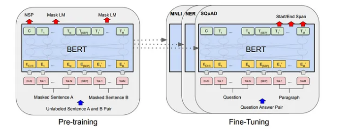
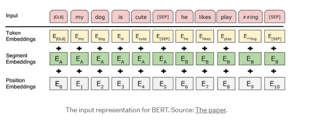
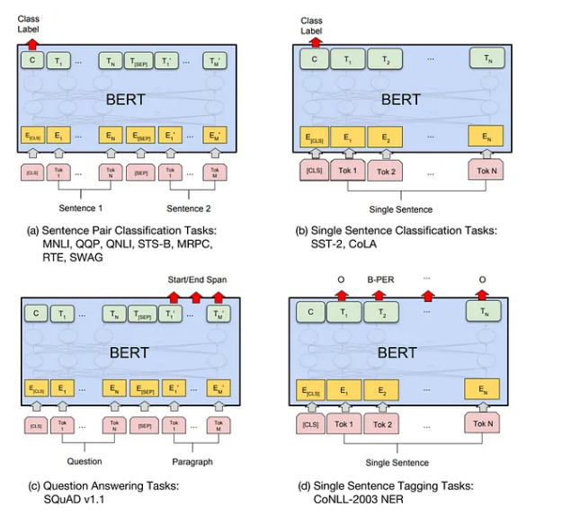

## 1. What is BERT ?? 
BERT stands for Bidirectional Encoder Represantations from Transformers và language representation model của  Google. Nó sử dụng hai bước là pre-train vs fine-tune để tạo ra các model hiện đại cho nhiều nhiệm vụ. 

Trước tiên họ đào tạo model về các pre-train task. Sau khi quá trình pre-train hoàn tất, model tương tự được fine-tune cho nhiều nhiệm vụ cụ thể ở phía sau

## 2. BERT Architecture 

Một cách đơn gian, BERT là 1 stack của Tranformer Encoder

Một số thông số của model pretrain: 

**L** =  num layer 

**H** = hidden_state 

**A** = number of heads 

    * BERT Base: L = 12, H = 768, A = 12 
    * BERT Large: L = 24, H = 1024, A = 16

### 2.1 Masked Language Model (MLM)

Một số token đầu vào sẽ bị che dấu( một cách random) bằng cách thay thế bằng [MASK] và mô hình sẽ cố gắng dự đoán các token bị che dấu này chứ không phải toàn bộ chuỗi đầu vào. Sau đó các token này sau khi được dự đoán sẽ cho vào lớp softmax đầu ra  để có được các từ đầu ra cuối cùng. 

Tuy nhiên điều này tạo ra sự không phù hợp giữa pretrain và fine-tuning vì nhiệm vụ fine-tune không liên quan đến việc dự đoán các từ bị che dấu. Điều này được giảm thiểu bằng cách thay đổi trong các che dấu các token đầu vào 

* Trong số 15% các token định che dấu: 

    * 80% che dấu bằng MASK 
    * 10% che dấu bằng cách thay thế bởi các từ khác 
    * 10 % giữ nguyên token

### 2.2 Next Sentence Prediction(NSP) 
BERT chỉ có Encoder nên nó không nắm bắt trực tiếp mối quan hệ giữa hai câu trong các nhiệm vụ như QuestionAnswer hay Natural Languge Inference. BERT tập trng cáo mối quan hệ giữa các từ trong câu. 

Trong nhiệm vụ này A và B là hai câu được chọn để đào tạo trước 

* 50% B được dùng làm câu tiếp theo sau A 
* 50% B là một câu ngẫu nhiên trong kho dữ liệu
## 3. Training 

### 3.1 Input 

Mô hình cần lấy input cho cả một hoặc hai câu được đóng gói với nhau. Lưu ý một câu là một đoạn văn bản tùy ý chứ không phải 1 câu trong văn học. Token [SEP] được sử dụng để ngăn cách các câu

Có một số vấn đề sau: 

* Position Embedding: Transformer ko cho đầu vào tuần tự như RNN mà nó cho tất cả vào cũng lúc vì thế thông tin về vị trí là rất quan trọng 

* SegmentEmbeding: Chúng cung cấp thông tin về câu mà token cụ thể là một phần của câu đó 
### 3.2 Ouputs
Làm sao dự đoán kết quả đầu ra cho hai nhiệm vụ cùng lúc? Câu trả lời là sử dụng các lớp FFN + Softmax khác nhau trên các last encoder.

Token đầu tiên đầu vào luôn là Token [CLS] Trạng thái cuối cùng tương ứng với token này được sử dụng làm biểu diễn chuối tổng hợp cho các nhiệm vụ phân loại và dự đoán câu tiếp theo
## 4. Fine-tuning BERT 

## 5.REF 
https://towardsdatascience.com/keeping-up-with-the-berts-5b7beb92766